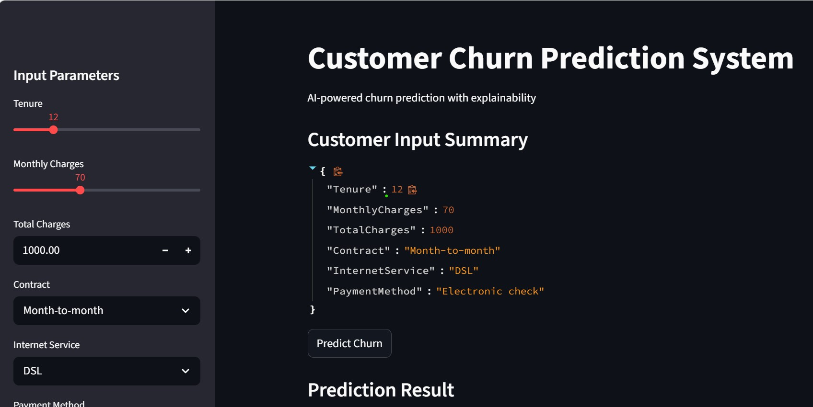
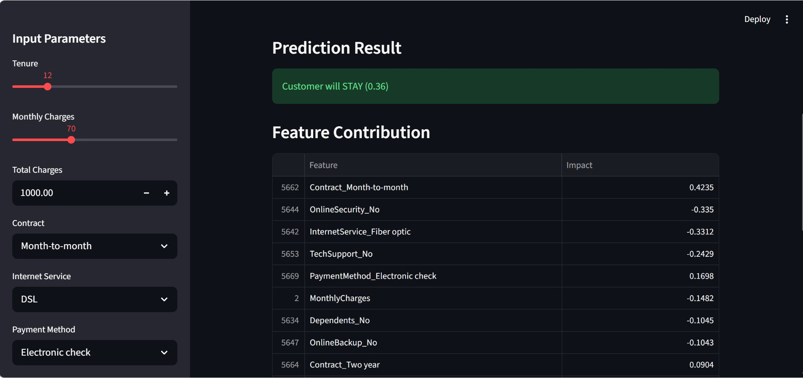

# Customer Churn Prediction System

## 📌 Overview

This project predicts customer churn using an XGBoost model with MLflow tracking and SHAP explainability.
It includes a complete ML pipeline with API deployment and an interactive dashboard.

---

## 🏗️ Architecture

```
[Streamlit UI]
        ↓
HTTP Request (POST /predict)
        ↓
[FastAPI (Dockerized)]
        ↓
[XGBoost Model]
        ↓
Prediction + SHAP Explanation
        ↓
Back to Streamlit UI
```

---

## 🚀 Features

* XGBoost model with hyperparameter tuning
* Threshold optimization (F1-score)
* SHAP explainability
* MLflow experiment tracking
* FastAPI backend
* Streamlit frontend
* Docker support

---

## ⚙️ How to Run

### 1️⃣ Train Model

```bash
python main.py
```

### 2️⃣ Run API

```bash
uvicorn api.app:app --reload
```

### 3️⃣ Run Streamlit

```bash
streamlit run dashboard/streamlit_app.py
```

---

## 📸 Screenshots

### 🔹 Streamlit Interface



### 🔹 Prediction Result


*Model predicts customer will stay with probability score*

### 🔹 Feature Contribution


*Top features influencing the prediction*

---

## 🧰 Tech Stack

* Python
* XGBoost
* FastAPI
* Streamlit
* MLflow
* SHAP
* Docker

---

## 📦 Project Structure

```
api/            # FastAPI backend
dashboard/      # Streamlit frontend
src/            # ML pipeline
mlops/          # MLflow tracking
models/         # Saved model
```
